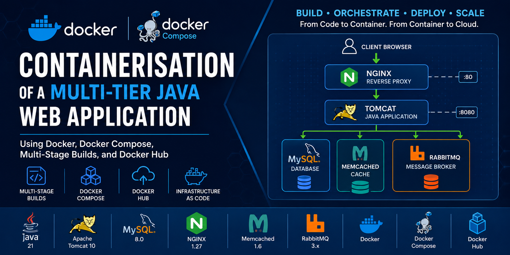
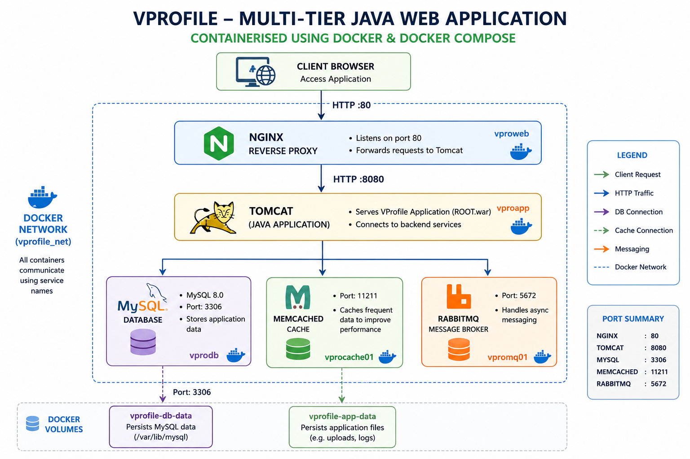

# Containerisation of a Multi-Tier Java Web Application Using Docker, Docker Compose, Multi-Stage Builds, and Docker Hub



## 📌 Project Overview

This project demonstrates how to **containerise an existing Java-based multi-tier web application (VProfile)** using **Docker**, **Docker Compose**, **multi-stage Docker builds**, and **Docker Hub**.

The application, originally deployed on virtual machines, is transformed into a fully containerised solution using production-ready Docker practices. The project includes building custom Docker images, orchestrating multiple containers, managing persistent storage, and publishing images to Docker Hub for reuse.

The final solution provides a portable, reproducible, and cloud-ready deployment that serves as a foundation for future Kubernetes deployments.

---

## 🏗️ Architecture



---

# 🚀 Features

- Containerisation of an existing Java web application
- Multi-stage Docker builds
- Custom Docker images
- Docker Compose orchestration
- Persistent Docker volumes
- Automatic MySQL database initialisation
- Reverse proxy with Nginx
- RabbitMQ messaging
- Memcached integration
- Docker Hub image publishing
- Infrastructure as Code (IaC)

---

# 🛠️ Technology Stack

| Category | Technology |
|----------|------------|
| Container Platform | Docker Engine |
| Orchestration | Docker Compose |
| Image Registry | Docker Hub |
| Language | Java 21 |
| Build Tool | Maven 3.9 |
| Application Server | Apache Tomcat 10 |
| Reverse Proxy | Nginx |
| Database | MySQL 8 |
| Message Broker | RabbitMQ |
| Cache | Memcached |
| Virtualisation | Vagrant |
| Operating System | Ubuntu Linux |

---

# 📂 Project Structure

```text
vprofile-project/
│
├── Dockerfiles/
│   ├── app/
│   │     └── Dockerfile
│   │
│   ├── db/
│   │     ├── Dockerfile
│   │     └── db_backup.sql
│   │
│   └── web/
│         ├── Dockerfile
│         └── nginxvproapp.conf
│
├── compose.yaml
│
├── src/
│
├── pom.xml
│
├── vagrant/
│
└── README.md
```

---

# 📋 Prerequisites

Before starting, ensure you have:

- Git
- Docker Engine
- Docker Compose
- Vagrant
- VirtualBox
- Docker Hub Account

---

# 📖 Deployment Workflow

Detailed step-by-step deployment procedures, configuration details, and workflow documentation are available in the [Setup Guide](./Setup-Guide.md).

## 1. Clone the Repository

```bash
git clone https://github.com/OlumideOlumayegun/containerisation-of-java-web-app-using-docker.git

cd dcontainerisation-of-java-web-app-using-docker
```

---

## 2. Switch to the project directory

```bash
cd dcontainerisation-of-java-web-app-using-docker

cd vagrant
```

---

## 3. Start the Development VM

```bash
vagrant up

vagrant ssh
```

---

## 4. Build Docker Images

```bash
docker compose build
```

This builds:

- vprofileapp
- vprofiledb
- vprofileweb

---

## 5. Deploy the Application

```bash
docker compose up -d
```

Docker Compose will automatically:

- Create Docker network
- Create Docker volumes
- Build custom images
- Pull official images
- Start all five containers

---

## 6. Verify Containers

```bash
docker ps
```

Expected containers:

- vprodb
- vproapp
- vproweb
- vprocache01
- vpromq01

---

## 7. Access the Application

Open your browser:

```
http://<VM-IP>
```

Example:

```
http://192.168.56.16
```

---

# 🔍 Application Verification

Verify the following:

✅ Home page loads

✅ Login succeeds

✅ MySQL connectivity

✅ RabbitMQ connectivity

✅ Memcached caching

---

# 🗂️ Docker Images

| Image | Description |
|--------|-------------|
| vprofile-app | Java Application (Tomcat) |
| vprofile-db | MySQL Database |
| vprofile-web | Nginx Reverse Proxy |
| memcached | Official Image |
| rabbitmq | Official Image |

---

# 💾 Persistent Volumes

Docker Compose creates persistent storage for:

| Volume | Purpose |
|---------|----------|
| vprofile-db-data | MySQL database |
| vprofile-app-data | Tomcat webapps |

---

# 🌐 Container Networking

Docker Compose automatically creates an isolated bridge network.

Containers communicate using service names:

| Service | Hostname |
|----------|----------|
| Database | vprodb |
| Application | vproapp |
| Cache | vprocache01 |
| RabbitMQ | vpromq01 |
| Web | vproweb |

---

# 📤 Publish Images to Docker Hub

Login

```bash
docker login
```

Push images

```bash
docker push <username>/vprofileapp

docker push <username>/vprofiledb

docker push <username>/vprofileweb
```

---

# 🧹 Cleanup

Stop containers

```bash
docker compose down
```

Remove unused volumes

```bash
docker volume prune
```

Remove unused Docker resources

```bash
docker system prune -a
```

Shutdown VM

```bash
vagrant halt
```

---

# 📈 Skills Demonstrated

- Docker
- Docker Compose
- Docker Hub
- Multi-stage Docker Builds
- Java Application Containerisation
- Reverse Proxy Configuration
- MySQL Initialisation
- Docker Networking
- Docker Volumes
- Infrastructure as Code
- Linux Administration
- Application Deployment Automation

---

# 🎯 Learning Outcomes

By completing this project, you will learn how to:

- Analyse an existing application for containerisation
- Select appropriate Docker base images
- Write production-ready Dockerfiles
- Build efficient multi-stage Docker images
- Configure Docker networking
- Manage Docker volumes
- Deploy multi-container applications
- Publish images to Docker Hub
- Apply Infrastructure as Code principles

---

# 📚 Future Enhancements

- Deploy to Kubernetes
- Helm Charts
- GitHub Actions CI/CD
- Docker Image Scanning
- Container Health Checks
- Secrets Management
- Kubernetes Ingress
- Horizontal Pod Autoscaling
- Monitoring with Prometheus & Grafana

---

# 📜 Related Projects

- Multi-Tier Web Application Deployment on Local Infrastructure Using Vagrant
- Automated Multi-Tier Web Application Deployment Using Bash Scripting
- Lift-and-Shift Deployment of a Multi-Tier Web Application on AWS
- Cloud-Native Refactoring of a Multi-Tier Web Application on AWS
- Kubernetes Deployment of a Multi-Tier Java Web Application *(Coming Next)*

---

# 👨‍💻 Author

**Olumide Olumayegun**

**Process Engineer | DevOps Engineer | Data Scientist**

Bridging **DevOps, Cloud Engineering, Data Science, and AI** to build scalable, automated, and intelligent engineering solutions.

---

